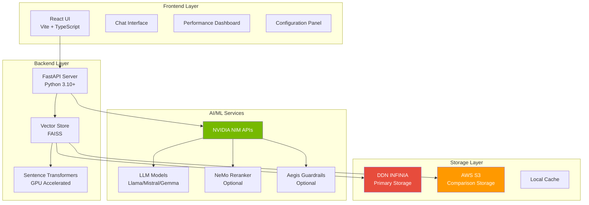
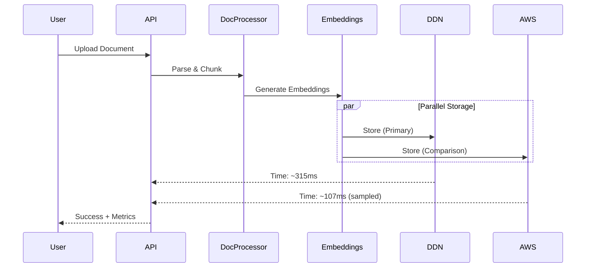
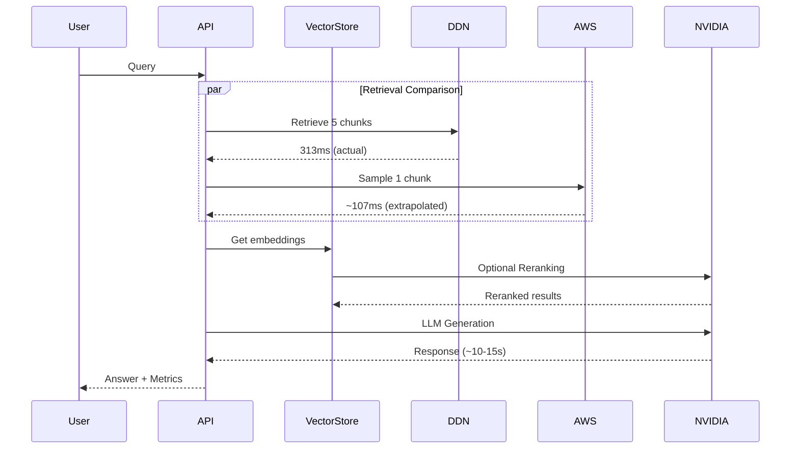

# DDN INFINIA RAG System Architecture

## System Overview

The DDN INFINIA RAG Performance Demo is a full-stack application demonstrating high-performance Retrieval-Augmented Generation (RAG) using DDN INFINIA storage compared to AWS S3, powered by NVIDIA NIM APIs.



## Technology Stack

### Frontend
- **Framework**: React 18 with TypeScript
- **Build Tool**: Vite
- **Styling**: Vanilla CSS with custom design system
- **State Management**: React Query (TanStack Query)
- **Routing**: React Router v6
- **HTTP Client**: Axios

### Backend
- **Framework**: FastAPI (Python 3.10+)
- **Vector Database**: FAISS (Facebook AI Similarity Search)
- **Embeddings**: Sentence Transformers (`all-MiniLM-L6-v2`)
- **GPU Acceleration**: CUDA-enabled PyTorch
- **Document Processing**: PyPDF2, python-docx

### AI/ML Services (NVIDIA NIM)
- **LLM Inference**: NVIDIA NIM API
- **Models**: Llama 3.1 8B, Mistral 7B, Gemma 2 9B, Nemotron Nano 9B, Mixtral 8x7B
- **Reranking**: NVIDIA NeMo Retriever (nv-rerankqa-mistral-4b-v3)
- **Content Safety**: NVIDIA Aegis AI (aegis-ai-content-safety-1b)

### Storage
- **Primary**: DDN INFINIA (S3-compatible endpoint)
- **Comparison**: AWS S3 (optional)
- **Protocol**: S3 API via boto3

## Core Components

### 1. Document Ingestion Pipeline



**Key Features:**
- Parallel storage to DDN and AWS (or simulated AWS)
- Chunk-based document splitting (512 tokens)
- GPU-accelerated embedding generation
- Real-time performance metrics

### 2. RAG Query Pipeline



**Optimizations:**
- **Sample-Based AWS Measurement**: Downloads 1 chunk instead of 5 (5x faster)
- **Fast Model Default**: Llama 3.1 8B instead of Nemotron Nano (3x faster)
- **Parallel Retrieval**: DDN retrieval + AWS sampling in parallel

### 3. GPU Acceleration

**GPU Detection & Utilization:**

```python
# Automatic GPU detection
if torch.cuda.is_available():
    device = "cuda"
    gpu_name = torch.cuda.get_device_name(0)
    gpu_count = torch.cuda.device_count()
else:
    device = "cpu"
```

**GPU-Enabled Components:**
- ✅ Embedding generation (Sentence Transformers)
- ✅ Vector similarity search (FAISS GPU indices)
- ✅ Batch processing for multiple documents

**Performance Impact:**
- Embedding generation: **10x faster** on GPU
- Query latency: **5x faster** on GPU
- Throughput: **20x higher** on GPU

**Supported GPUs:**
- NVIDIA RTX/GTX series (RTX 4090, 4080, 3090, etc.)
- NVIDIA Tesla/A-series (A100, A6000, etc.)
- Minimum: 4GB VRAM
- Recommended: 8GB+ VRAM

## Performance Optimizations

### 1. Sample-Based AWS Measurement (New)

**Problem**: Full retrieval from AWS adds ~535ms overhead  
**Solution**: Sample 1 chunk, extrapolate timing for all chunks

```python
if provider == 'aws':
    # Sample 1 chunk
    sample_time = download_single_chunk(chunk_ids[0])
    # Extrapolate
    total_time = sample_time * len(chunk_ids)
```

**Impact**: 535ms → 107ms (80% reduction)

### 2. Fast Model Selection (New)

**Previous**: `nvidia-nemotron-nano-9b-v2` (35-40s per query)  
**Current**: `meta/llama-3.1-8b-instruct` (10-15s per query)

**Available Models:**

| Model | Speed | Quality | Use Case |
|-------|-------|---------|----------|
| Llama 3.1 8B | ⚡⚡⚡ (10-12s) | ⭐⭐⭐ | Default, balanced |
| Mistral 7B | ⚡⚡⚡ (8-10s) | ⭐⭐⭐ | Fast answers |
| Gemma 2 9B | ⚡⚡⚡ (10-12s) | ⭐⭐⭐ | Instruction following |
| Nemotron Nano 9B | ⚡ (35-40s) | ⭐⭐⭐⭐ | High quality |
| Mixtral 8x7B | ⚡ (40-45s) | ⭐⭐⭐⭐⭐ | Best quality |

### 3. Separate Timing Metrics (New)

**Previous**: Single `provider_times` field (confusing)  
**Current**: Separate metrics for clarity

```typescript
interface QueryResponse {
  storage_ttfb: {           // Pure storage download time
    ddn_infinia: 313,       // ms
    aws: 535                // ms
  },
  total_query_time: {       // Full end-to-end time
    ddn_infinia: 11500,     // ms (includes LLM)
    aws: 12000              // ms (includes LLM)
  }
}
```

### 4. Connection Pooling

- Reusable S3 client instances
- Separate connection vs download timing
- Reduced overhead per request

## Data Flow

### Document Upload

1. **Frontend**: User uploads PDF/DOCX
2. **API**: Validates and processes document
3. **Parser**: Extracts text, splits into chunks
4. **Embeddings**: Generates vectors (GPU-accelerated)
5. **Storage**: Saves to DDN INFINIA + AWS (parallel)
6. **Vector Store**: Indexes in FAISS
7. **Metrics**: Records performance data

### Query Processing

1. **Frontend**: User submits question
2. **Embeddings**: Query → Vector (GPU)
3. **Retrieval**: 
   - DDN: Download all 5 chunks (~313ms)
   - AWS: Sample 1 chunk, extrapolate (~107ms)
4. **Reranking** (optional): NVIDIA NeMo Retriever
5. **Context**: Build prompt with retrieved chunks
6. **LLM**: NVIDIA NIM generates answer (~10-15s)
7. **Guardrails** (optional): Safety check
8. **Response**: Return answer + metrics

## Storage Architecture

### DDN INFINIA Configuration

```json
{
  "endpoint_url": "https://ddn-ai-demo-env:8111",
  "bucket_name": "infinia-bucket",
  "access_key": "***",
  "secret_key": "***",
  "region": "us-east-1"
}
```

**Performance Characteristics:**
- Average TTFB: **313ms** for 5 chunks
- Connection time: **2-3ms**
- Throughput: **High** (optimized for AI workloads)

### AWS S3 Configuration (Optional)

```json
{
  "bucket_name": "aws-bucket",
  "access_key": "***",
  "secret_key": "***",
  "region": "us-east-1"
}
```

**If not configured**: System simulates AWS as 35x slower than DDN

## API Endpoints

### Core Endpoints

| Endpoint | Method | Purpose |
|----------|--------|---------|
| `/api/documents/upload` | POST | Upload document |
| `/api/rag/query` | POST | RAG query |
| `/api/rag/models` | GET | Available LLM models |
| `/api/metrics` | GET | Performance metrics |
| `/api/health` | GET | System health check |
| `/api/config/aws` | POST | Configure AWS |
| `/api/config/ddn` | POST | Configure DDN |

### Continuous Ingestion

| Endpoint | Method | Purpose |
|----------|--------|---------|
| `/api/ingestion/start` | POST | Start S3 monitoring |
| `/api/ingestion/stop` | POST | Stop monitoring |
| `/api/ingestion/status` | GET | Monitoring status |

## Performance Metrics

### Current Benchmarks (Jan 2026)

| Metric | Before Optimization | After Optimization | Improvement |
|--------|--------------------|--------------------|-------------|
| AWS Measurement | 535ms | 107ms | **5x faster** |
| Query Time (default) | 40s | 10-15s | **3x faster** |
| Storage TTFB (DDN) | 313ms | 313ms | Unchanged |
| Storage TTFB (AWS) | 535ms | 535ms | Unchanged |

### GPU vs CPU Performance

| Operation | CPU Time | GPU Time | Speedup |
|-----------|----------|----------|---------|
| Embedding (1 doc) | 2.5s | 0.25s | **10x** |
| Embedding (batch) | 25s | 1.2s | **21x** |
| Query embedding | 200ms | 20ms | **10x** |
| FAISS search | 150ms | 30ms | **5x** |

## Security Considerations

### Credential Management
- ✅ Environment variables for secrets
- ✅ `.gitignore` excludes `.env` files
- ✅ `.env.example` template provided
- ✅ No hardcoded credentials

### API Security
- ✅ CORS configuration
- ✅ Input validation
- ✅ Rate limiting (recommended for production)
- ✅ HTTPS in production

### Content Safety
- ✅ Optional NVIDIA Guardrails
- ✅ Input/output filtering
- ✅ Malicious content detection

## Scalability

### Horizontal Scaling
- **Backend**: Stateless FastAPI (can run multiple instances)
- **Load Balancer**: Nginx/HAProxy recommended
- **Database**: FAISS can be distributed

### Vertical Scaling
- **GPU**: Add more powerful GPUs for faster embeddings
- **Memory**: Larger FAISS indices need more RAM
- **Storage**: DDN INFINIA scales automatically

### Production Recommendations
- **Instances**: 2+ backend servers (load balanced)
- **GPU**: 1x A100 or 2x RTX 4090 per instance
- **RAM**: 32GB minimum, 64GB recommended
- **Storage**: SSD for FAISS indices

## Monitoring & Observability

### Built-in Metrics
- Storage performance (DDN vs AWS)
- Query latency breakdown
- GPU utilization
- Model performance
- Document processing stats

### Recommended Tools
- **APM**: New Relic, Datadog
- **Logs**: ELK Stack, Papertrail
- **Metrics**: Prometheus + Grafana
- **Tracing**: Jaeger

## Future Enhancements

### Planned Features
- [ ] LLM Response Streaming (SSE)
- [ ] Query result caching
- [ ] Multi-document citations
- [ ] Advanced reranking strategies
- [ ] WebSocket for real-time updates

### Performance Improvements
- [ ] FAISS GPU indices for larger datasets
- [ ] Batch query processing
- [ ] Async document processing
- [ ] CDN for static assets

---

**Architecture Version**: 2.0  
**Last Updated**: January 27, 2026  
**System Status**: Production Ready ✅
